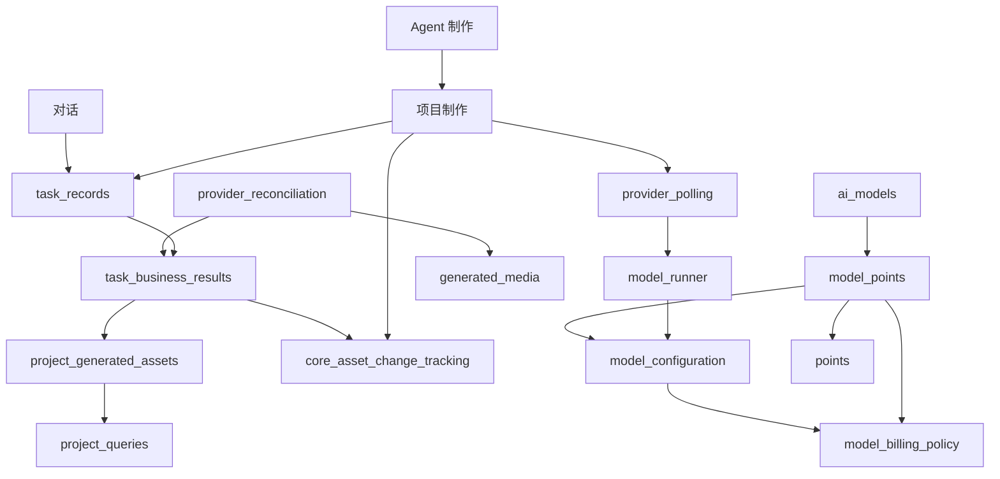

# OPT-09 模块目录与依赖核对

## 迁移前的实际依赖

检查包含函数内导入。OPT-05 至 OPT-08 完成后，以下调用关系已经成立；本项据此整理目录，不改变这些调用链的业务和事务行为。

这是主要业务链路图，不代表所有导入。项目读取不调用项目生命周期；计费策略不反向依赖配置。Agent 与项目之间的复用，以及生成结果对具体业务的更新，保留到各自明确的叶子模块。

## 目录归属

| 子包 | 迁入内容 | 对外调用方式 |
| --- | --- | --- |
| `app.services.conversation` | 对话管理；另按行为分出文本上下文、视频请求输入处理 | 路由调用 `service`；请求准备直接调用 `text_context`、`video_inputs` |
| `app.services.projects` | 项目生命周期、读取、章节、资产、分镜及生成历史，共 11 个原模块 | 普通项目访问使用 `queries`；制作操作调用对应业务模块 |
| `app.services.agent` | Agent 工作流、内容制作、审核、来源文档及核心资产变更追踪，共 29 个原模块 | 调用具体制作模块；资产变更通知使用 `core_asset_changes` |
| `app.services.generation` | 模型执行、任务状态与执行、结果回收/落库、轮询和媒体转存，共 9 个原模块 | 使用 `runner`、`task_records`、`provider_reconciliation` 等具体入口 |
| `app.services.models` | 模型目录管理与请求配置，共 2 个原模块 | 管理使用 `catalog`；配置读取使用 `configuration` |
| `app.services.billing` | 积分账本、充值、模型计费策略与结算，共 4 个原模块 | 规则使用 `policy`，模型结算使用 `model_points`，账本变更使用 `points` |

迁移前 `services` 顶层有 73 个 Python 文件（含 `__init__.py`），其中 56 个业务模块迁入上述子包。认证、上传、素材、作品及其他独立业务保留原有模块归属。

各子包的 `__init__.py` 只说明职责，不批量导入或转发函数。业务直接导入具体叶子模块，避免包初始化引入隐含的依赖关系。`app.tasks` 是已发布的 Celery 入口，文件位置、任务名称、队列和 Beat 调度保持不变。

## 接口收敛

- 对话事务与任务提交留在 `conversation.service`；文本上下文构造迁入 `conversation.text_context`；视频模式、媒体收集与校验编排迁入 `conversation.video_inputs`。两个模块向对话服务分别提供 `build_text_context_messages`、`build_video_message_extra`。
- 已供其他业务模块或任务调用的七个函数改为公共名称：`asset_analysis_config`、`asset_image_config`、`set_asset_image_generation_state`、`get_task_asset_variant`、`validate_asset_image_request`、`save_source_document`、`enqueue_source_analysis`。实现、参数、事务约定保持不变，调用方同步更新。
- 旧模块路径不保留转发文件；测试、运行时导入和字符串形式的 monkeypatch 目标同步迁移。历史计划中的文件链接指向新位置，历史执行描述保留原名称便于追溯。

## 验收后的依赖状态

- 六个子包均只通过具体叶子模块导入；旧服务文件已移除。代码、测试字符串、脚本与部署配置中没有残留失效服务路径。
- 全量检查覆盖 230 个应用模块，没有新增循环。包含延迟导入的静态图保留一个由 21 个模块组成的既有环，涉及 Worker 注册、Celery 任务和业务提交的相互引用；其成员对应迁移前相同模块。
- `projects.lifecycle`、`projects.queries`、`projects.generated_assets`、`generation.task_records`、`generation.business_results`、`models.configuration`、`billing.policy`、`billing.model_points` 均不处于循环中，前几项优化建立的职责划分保持有效。
- 独立进程 Worker 导入、17 个任务注册及 Beat 调度通过核对；248 个 HTTP 操作和完整 OpenAPI 与迁移前一致。非数据库回归 685 项通过。

检查命令、结果与未验证范围记录在[计划表](计划表.md)的 OPT-09 执行记录中。

OPT-10 已补齐[当前架构与事务说明](../docs/后端架构与事务.md)及[完整回归结果](../docs/测试与回归.md)，本页保留目录迁移时的验收快照。
